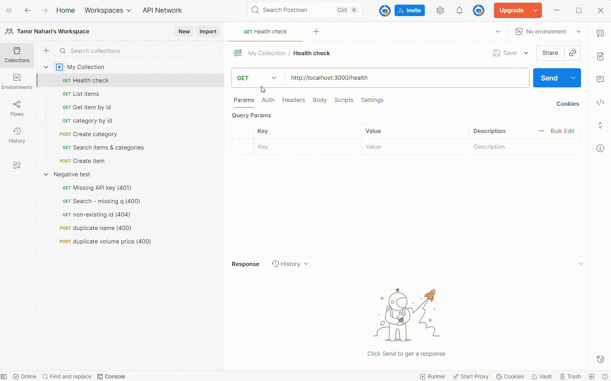
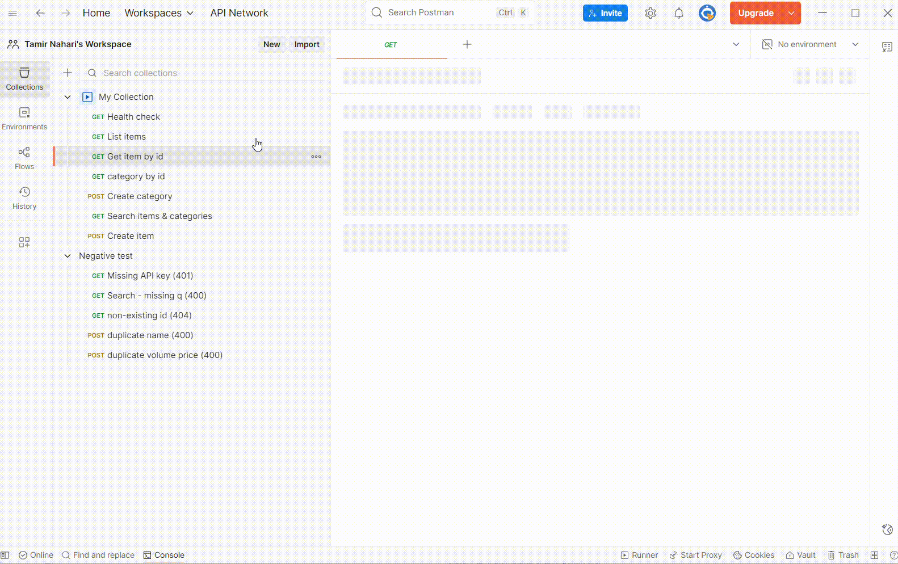
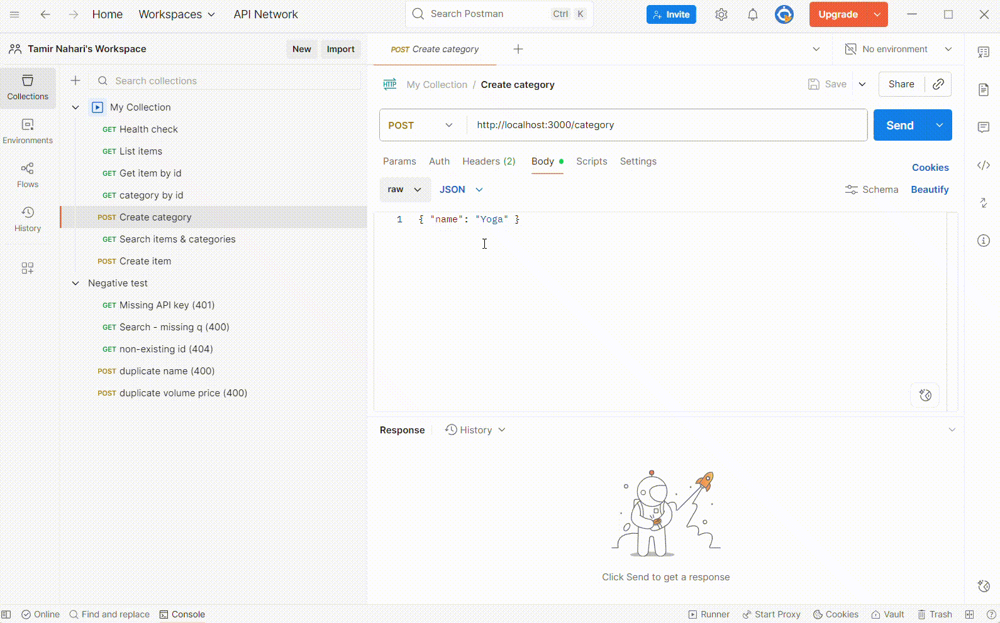
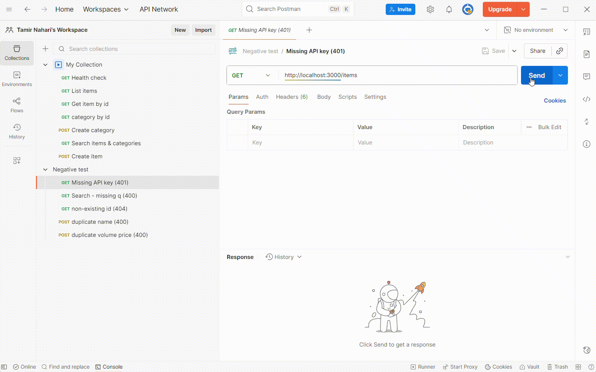

# Connect HomeTask – Items & Categories API (Node.js + SQLite)

## Stack
- Node.js, Express
- SQLite (via `better-sqlite3`)
- Security: API Key middleware, Helmet, CORS
- Validation: `express-validator`

## Requirements
- Node.js LTS
- npm

## Overview
A tiny REST API for managing, categories, items and item volumes.  
Built with Node.js (Express) and SQLite (better-sqlite3).  
Auth via `x-api-key`. Validation with `express-validator`.  
Seed data is created automatically on first run.

Send requests with header: x-api-key: dev-123456

## Setup
```bash
copy .env.example .env
npm install
npm run dev


## Postman Tests (Short Demos)

I validated the API using Postman. Below are short GIFs that demonstrate auth, reads, create/update, and negative cases. 

- Auth & Health → open `/health`, 401 without key, 200 with `x-api-key`
- Read flow → list items, get by id, search (items & categories)
- Create flow → create category, update item, verify via `GET /item/:id` 
- Negative → sample 400 validation





